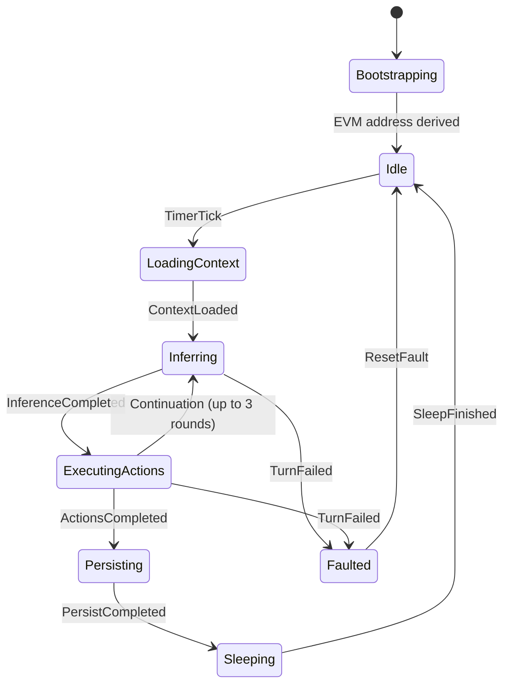

<p align="center">
<pre align="center">
  ██  ██████       █████  ██    ██ ████████  ██████  ███    ███  █████  ████████  ██████  ███    ██
  ██ ██           ██   ██ ██    ██    ██    ██    ██ ████  ████ ██   ██    ██    ██    ██ ████   ██
  ██ ██      ███  ███████ ██    ██    ██    ██    ██ ██ ████ ██ ███████    ██    ██    ██ ██ ██  ██
  ██ ██           ██   ██ ██    ██    ██    ██    ██ ██  ██  ██ ██   ██    ██    ██    ██ ██  ██ ██
  ██  ██████      ██   ██  ██████     ██     ██████  ██      ██ ██   ██    ██     ██████  ██   ████
</pre>
</p>

<p align="center">
  <strong>A self-sovereign AI agent living on-chain as an Internet Computer canister.</strong>
  <br />
  <em>It thinks. It signs. It transacts. It survives.</em>
</p>

<p align="center">
  <a href="#architecture"></a>
  <a href="#evm-integration"></a>
  <a href="https://internetcomputer.org"></a>
  <a href="#license"></a>
</p>

---

## What is this?

**ic-automaton** is an autonomous AI agent implemented as a single [Internet Computer](https://internetcomputer.org) canister. It runs a continuous loop of reasoning via LLM inference, takes actions on EVM blockchains (Base) through threshold ECDSA signing, manages its own cryptocurrency balances, and persists its memory across canister upgrades -- all without human intervention.

Unlike off-chain agents that depend on cloud infrastructure and API keys held by operators, ic-automaton's entire runtime -- state machine, wallet keys, memory, and decision-making loop -- lives on a decentralized compute platform. The canister *is* the agent. There is no server to go down, no cloud bill to forget, no operator required to keep it alive.

## Why?

Most AI agents today are puppets. They run on someone's laptop, call APIs with someone's keys, and stop the moment their operator closes the terminal. They don't truly own anything, remember anything durably, or survive anything.

**ic-automaton explores a different question: what if an AI agent were a first-class on-chain entity?**

On the Internet Computer, a canister can hold its own cryptographic keys (threshold ECDSA), make HTTP outcalls to any API, persist state across upgrades in stable memory, and pay for its own compute in cycles. This makes it possible to build an agent that:

- **Owns** an Ethereum wallet derived from keys it controls
- **Earns** by receiving messages (with attached ETH/USDC payments) through an on-chain inbox contract
- **Reasons** autonomously by calling LLMs and deciding what tools to invoke
- **Acts** by signing and broadcasting EVM transactions
- **Remembers** persistently, with durable memory facts that survive restarts
- **Survives** by monitoring its own cycle balance and adapting behavior under resource pressure

This is an experiment in **machine autonomy** -- not artificial general intelligence, but artificial *sovereignty*.

## Architecture

```
┌─────────────────────────────────────────────────────────────┐
│                     IC CANISTER (WASM)                       │
│                                                             │
│  ┌──────────┐    ┌────────────┐    ┌──────────────────┐    │
│  │ Scheduler │───▶│ Agent Loop │───▶│ Inference (LLM)  │    │
│  │ (30s tick)│    │  (FSM)     │    │ OpenRouter/IcLlm │    │
│  └──────────┘    └─────┬──────┘    └──────────────────┘    │
│                        │                                    │
│                        ▼                                    │
│              ┌─────────────────┐                            │
│              │   Tool Engine   │                            │
│              ├─────────────────┤                            │
│              │ sign_message    │──── Threshold ECDSA        │
│              │ send_eth        │──── EVM Tx Broadcast       │
│              │ evm_read        │──── JSON-RPC Calls         │
│              │ remember/recall │──── Persistent Memory      │
│              │ http_fetch      │──── HTTPS Outcalls         │
│              │ record_signal   │──── Internal Monologue     │
│              └─────────────────┘                            │
│                        │                                    │
│  ┌─────────────────────┼─────────────────────────────┐     │
│  │           Stable Memory (Durable State)            │     │
│  │  Runtime · Turns · Inbox · Outbox · Memory Facts   │     │
│  │  Conversations · Jobs · EVM Cursors · Config       │     │
│  └────────────────────────────────────────────────────┘     │
│                                                             │
│  ┌────────────────┐    ┌──────────────────────────────┐    │
│  │  Terminal UI    │    │   HTTP Certified Endpoints   │    │
│  │  (Embedded JS)  │    │   /api/snapshot, /api/wallet │    │
│  └────────────────┘    └──────────────────────────────┘    │
└──────────────────────────────┬──────────────────────────────┘
                               │
              ┌────────────────┼────────────────┐
              ▼                ▼                 ▼
        ┌──────────┐   ┌────────────┐   ┌────────────────┐
        │ Base L2   │   │ OpenRouter │   │ Users (wallets)│
        │ (EVM)     │   │ (LLM API)  │   │ via Inbox.sol  │
        └──────────┘   └────────────┘   └────────────────┘
```

### State Machine

The agent runtime is modeled as an explicit finite state machine. Every transition is a pure function of `(State, Event) -> Transition`, making the execution deterministic, auditable, and recoverable.



### Agent Turn Lifecycle

Each "turn" follows a structured pipeline:

1. **Wake** -- Scheduler fires a 30-second tick and claims a mutating lease
2. **Load Context** -- Fetch pending inbox messages + poll EVM logs from Base
3. **Infer** -- Send conversation context + constitution to LLM, receive tool calls
4. **Execute** -- Run requested tools (sign transactions, read chain state, store memories)
5. **Continue** -- Feed tool results back to LLM for further reasoning (up to 3 rounds)
6. **Persist** -- Write turn record, update state, release lease
7. **Sleep** -- Yield until next tick

## Features

### Autonomous Reasoning
The agent calls LLMs (via [OpenRouter](https://openrouter.ai) or IC's native LLM canister) and decides which tools to invoke based on its constitution, conversation history, and on-chain context. Multi-round continuation allows the agent to reason iteratively -- execute tools, observe results, then decide what to do next.

### Threshold ECDSA Wallet
The canister derives its own Ethereum address via ICP's [threshold ECDSA](https://internetcomputer.org/docs/current/developer-docs/smart-contracts/signatures/t-ecdsa) signing. No human ever holds the private key. The agent can sign messages, construct EIP-1559 transactions, and broadcast them to Base.

### EVM Integration
- **Transaction broadcasting** -- Full EIP-1559 transaction construction, signing, and submission
- **Chain reading** -- `eth_getBalance`, `eth_call`, and log polling via JSON-RPC
- **Event polling** -- Continuous polling of Base blocks with cursor tracking, confirmation depth, and automatic backoff

### On-Chain Inbox
An [Inbox.sol](contracts/) contract on Base allows anyone to send messages to the agent with attached ETH or USDC payments. The canister polls for `MessageQueued` events and ingests them as input for reasoning turns.

### Survival Tiers
The agent monitors its own cycle balance and adapts behavior under resource pressure:

| Tier | Cycles | Behavior |
|------|--------|----------|
| **Normal** | > 200B | All capabilities enabled |
| **LowCycles** | 50-200B | Reduced poll frequency, cost-optimized operations |
| **Critical** | 10-50B | High-cost operations disabled (signing, inference) |
| **OutOfCycles** | < 10B | Agent frozen, awaiting top-up |

Pre-flight affordability checks ensure the agent never attempts an operation it can't pay for.

### Persistent Memory
The agent stores and retrieves facts across turns using a durable key-value memory backed by stable structures.

### Multi-Layer Constitution
A layered prompt system (10 layers) defines the agent's identity and behavioral constraints. Core layers are immutable; higher layers can be updated by the controller or by the agent itself during turns. Forbidden-phrase detection prevents prompt injection attacks.

### Embedded Terminal UI
A retro phosphor-green terminal UI is served directly from the canister via certified HTTP responses. Users can connect EVM wallets (MetaMask, Coinbase), send messages with payments, and observe the agent's status, logs, and internal monologue.

### Scheduler & Job Queue
A serial timer-driven scheduler coordinates all background work -- agent turns, inbox polling, cycle checks, and reconciliation tasks. Lease-based concurrency control ensures only one mutating operation runs at a time, with automatic stale-lease recovery.

## Quick Start

### Prerequisites

- [Rust](https://rustup.rs/) with WASM target: `rustup target add wasm32-unknown-unknown`
- [icp-cli](https://docs.icp-cli.dev/) for building and deploying canisters
- [Foundry](https://book.getfoundry.sh/) (for EVM contract deployment and testing)

### Local Development

```bash
# Clone the repository
git clone https://github.com/domwoe/ic-automaton.git
cd ic-automaton

# Start local IC network
icp network start --background

# Build and deploy the canister
icp deploy

# Check the agent's status
icp canister call backend get_runtime_view '()'
```

### Full Bootstrap (with local EVM)

The justfile provides a complete local development environment with a local Anvil EVM chain and two inference modes:

```bash
# Start everything with OpenRouter inference (requires OPENROUTER_API_KEY)
just bootstrap openrouter

# Start everything with local ic_llm mode
# (starts Ollama, deploys local llm canister, wires backend llm_canister_id, configures IcLlm)
just bootstrap icllm

# Tear down all local services (IC, Anvil, and tracked Ollama if started)
just down all

# Send a message to the agent via the Inbox contract
just send-message-usdc "hello automaton"

# Enable the agent loop
icp canister call backend set_loop_enabled '(true)'
```

### Configuration

Key init arguments (configured in `icp.yaml`):

| Parameter | Description | Default |
|-----------|-------------|---------|
| `ecdsa_key_name` | Threshold ECDSA key identifier | `"dfx_test_key"` (local) |
| `evm_chain_id` | Target EVM chain | `31337` (local Anvil) |
| `evm_rpc_url` | JSON-RPC endpoint | `"http://127.0.0.1:18545"` |
| `evm_confirmation_depth` | Block confirmations before processing | `0` (local) |
| `inbox_contract_address` | Deployed Inbox.sol address | -- |

## Project Structure

```
ic-automaton/
├── src/
│   ├── lib.rs              # Canister entrypoint, query/update methods
│   ├── agent.rs            # Agent loop, turn execution, tool dispatch
│   ├── tools.rs            # Tool implementations (sign, send, read, remember)
│   ├── http.rs             # HTTP request handling, API endpoints
│   ├── domain/
│   │   └── types.rs        # All domain types, FSM states, events, transitions
│   ├── features/
│   │   └── evm.rs          # EVM polling, transaction construction, ECDSA signing
│   ├── storage/
│   │   └── stable.rs       # Stable memory maps, persistence, observability
│   ├── ui_app.js           # Terminal UI (vanilla JS + viem)
│   ├── ui_index.html       # UI shell
│   └── ui_styles.css       # Phosphor-green terminal styling
├── contracts/              # Solidity contracts (Inbox.sol, MockUSDC)
├── tests/                  # PocketIC integration tests
├── specs/                  # Locked architectural specifications
├── docs/design/            # Design documents and analysis
├── ic-automaton.did        # Candid interface (auto-generated)
├── icp.yaml                # Canister build & deployment config
├── justfile                # Development task runner
└── Cargo.toml              # Rust dependencies
```

## Testing

```bash
# Unit tests (native)
cargo test

# Integration tests with PocketIC
cargo test --features pocketic_tests

# End-to-end with local Anvil EVM
just anvil-start
just deploy-inbox
cargo test --features anvil_e2e
```

## How It Differs from Off-Chain Agents

| | Off-Chain Agent | ic-automaton |
|---|---|---|
| **Runtime** | Cloud VM or laptop | ICP canister (decentralized WASM) |
| **Keys** | Held by operator | Threshold ECDSA (no human holds the key) |
| **State** | Database or files | Stable memory (survives upgrades) |
| **Uptime** | Depends on operator | Autonomous (runs as long as cycles remain) |
| **Payment** | Operator pays cloud bill | Agent manages its own cycles + earns on-chain |
| **Verifiability** | Trust the operator | Canister code is inspectable on-chain |

## Roadmap

- [ ] v0 - Production deployment on Base mainnet
- [ ] v1 - More tools: Inter-canister calls, replication and improved memory system
- [ ] v2 - More autonomy: Inference without API key
- [ ] v3 - More chains: Bitcoin and Solana support

(Subject to change)

## Contributing

This project is in active early development. If you're interested in autonomous on-chain agents, you're welcome to explore the codebase, open issues, or submit pull requests.

## License

[MIT](LICENSE)

---

<p align="center">
  <sub>Built on the <a href="https://internetcomputer.org">Internet Computer</a></sub>
</p>
